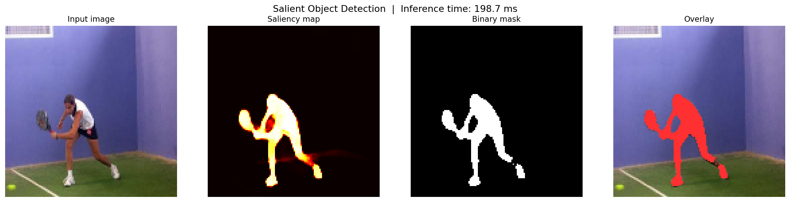

# Salient Object Detection (SOD) Project

A full end-to-end deep learning project that detects and segments the most visually important object in an image using a custom U-Net CNN architecture built from scratch in PyTorch.

## Results

| Metric | Baseline | U-Net (Improved) |
|--------|----------|------------------|
| IoU | 0.6221 | 0.8290 |
| Precision | 0.7317 | 0.9030 |
| Recall | 0.8173 | 0.9087 |
| F1-Score | 0.7444 | 0.8913 |

## Demo Output

## Project Structure
| File | Description |
|------|-------------|
| `data_loader.py` | Dataset loading, preprocessing, and augmentation |
| `sod_model.py` | U-Net CNN architecture from scratch |
| `train.py` | Training loop with early stopping and checkpointing |
| `evaluate.py` | Evaluation metrics and visualization |
| `demo.py` | Run inference on any image |

## Dataset
Uses the DUTS dataset — download from [Kaggle](https://www.kaggle.com/datasets/balraj98/duts-saliency-detection-dataset) and place in `data/` folder.

## How to Run

### Install dependencies
### 1. Clone the repository
### 2. Create a virtual environment
### 3. Install PyTorch with GPU support (CUDA 12.4)
### 4. Install remaining dependencies
### 5. Download the dataset
Create a Kaggle account at https://www.kaggle.com, go to Settings → API → Create New Token, then run:
### 6. Train the model
Training runs for 40 epochs with early stopping. The best model is automatically saved as `best_model_unet.pth`. A checkpoint is saved after every epoch so training can be resumed if interrupted.

### 7. Evaluate on the test set
This will print IoU, Precision, Recall and F1-Score on the test set, and save a visualization of 4 sample predictions to `results_visualization.png`.

### 8. Run the demo on a random test image
### 9. Run the demo on your own image

The demo outputs a 4-panel figure showing the input image, saliency map, binary mask, and overlay. Inference time is displayed in the title.

## Architecture
- Custom U-Net encoder-decoder with skip connections
- Encoder: 4 conv blocks (64 → 128 → 256 → 512 channels)
- Bottleneck: 1024 channels
- Decoder: 4 upsampling blocks with skip connections
- Loss: Binary Cross-Entropy + 0.5 × IoU Loss
- Optimizer: Adam (lr=1e-3)
- Training: 40 epochs with early stopping

## Requirements

### Hardware
- NVIDIA GPU recommended (tested on RTX 5070 12GB)
- 8GB+ RAM
- ~500MB disk space for dataset

### Software
- Python 3.9+
- PyTorch 2.0+ with CUDA 12.4+
- torchvision 0.15+
- numpy 1.24+
- opencv-python 4.7+
- matplotlib 3.7+
- scikit-learn 1.2+
- tqdm 4.65+
- kaggle 1.5+

### Install all dependencies
pip install torch torchvision torchaudio --index-url https://download.pytorch.org/whl/cu124
pip install numpy opencv-python matplotlib scikit-learn tqdm kaggle jupyter

### Tested Environment
- OS: Windows 11
- GPU: NVIDIA GeForce RTX 5070 12GB
- CUDA: 12.8
- Python: 3.13.5
- PyTorch: 2.12.0
